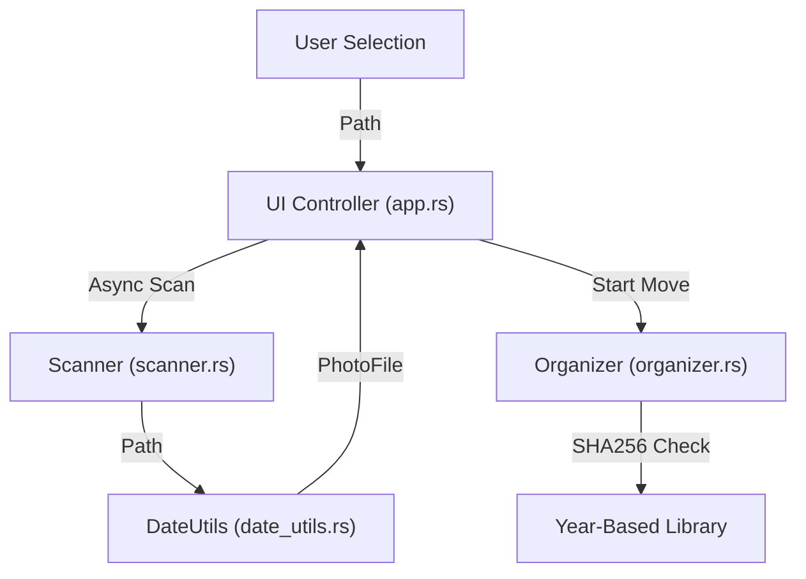

# Design Document: Photo & Video Organizer

## 1. Overview & Core Purpose
Photo Organizer is a high-performance Windows application designed to transform disorganized media collections into a structured, year-based library. It prioritizes data integrity by using EXIF metadata for sorting and SHA256 hashing for duplicate detection.

---

## 2. Functional Specification (The "What")

### 2.1 File discovery
- Recursive scanning of source directories.
- Supported extensions: `.jpg`, `.jpeg`, `.png`, `.heic`, `.mp4`, `.mov`, `.avi`.

### 2.2 Date Extraction Logic (Priority)
To ensure accuracy, the system uses a strict priority for date extraction:
1. **Photos**: `DateTimeOriginal` -> `DateTime` -> `DateTimeDigitized` -> File Modification Time.
2. **Videos**: Container-specific creation metadata -> File Modification Time.

### 2.3 Organization Hierarchy
Files are moved into the following structure:
- `Photos/YYYY/`
- `Videos/YYYY/`
- `Duplicates/` (For bitwise identical files identified via SHA256).
- **Support Development**: A dedicated modal via the sidebar to support the project and help fund a Code Signing Certificate.
- **Execution Warning**: A mandatory safety checklist modal that appears before organization begins, ensuring user acknowledgment of risks and backup status.

---

## 3. System Architecture (The "How")

### 3.1 Module Breakdown
- **`core/scanner.rs`**: Directory traversal via `walkdir`.
- **`core/date_utils.rs`**: Metadata extraction and fallback logic.
- **`core/organizer.rs`**: The "Engine." Handles directory creation, file moving, and hashing.
- **`ui/app.rs`**: State machine and immediate-mode GUI controller using `egui`.

### 3.2 Component Data Flow

---

## 4. Operational Safety & Optimization
- **Collision Handling**: Non-identical name collisions are resolved by appending `_copy_N`.
- **Concurrent Processing**: The UI remains responsive by delegating heavy I/O tasks to background threads.
- **State Management**: The application uses a central `ProcessState` enum to manage UI transitions cleanly.
